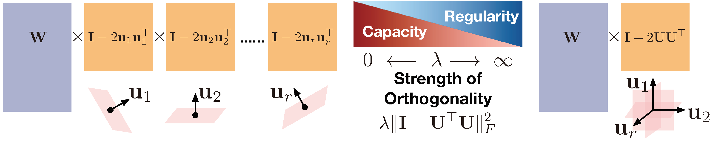
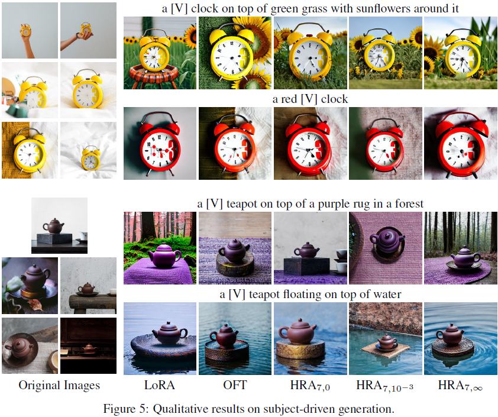
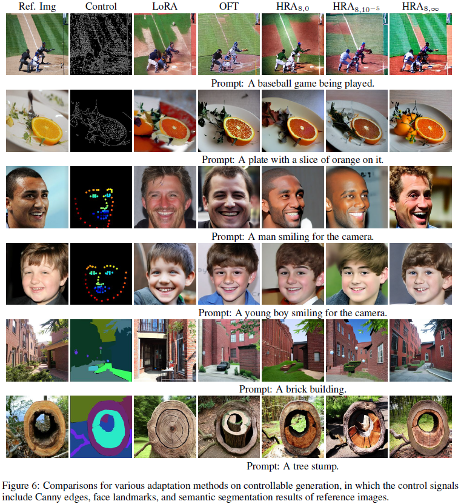
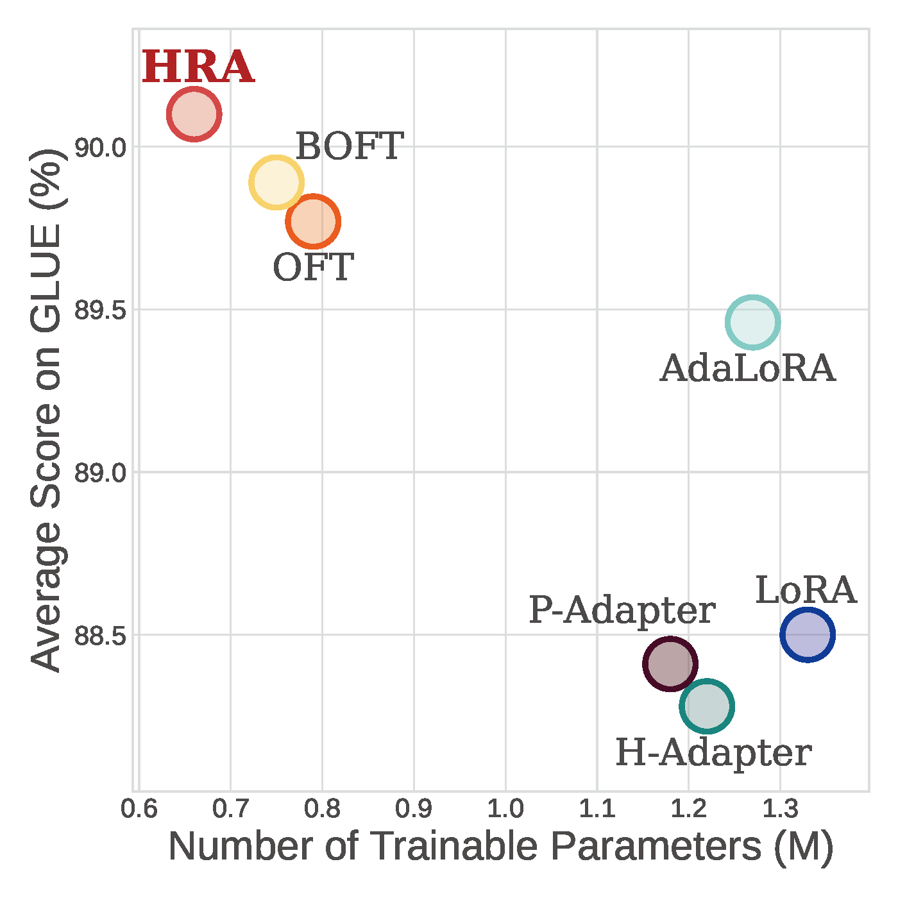

# Bridging The Gap between Low-rank and Orthogonal Adaptation via Householder Reflection Adaptation

<div align="center">
  
</div>

<p align="center">
  <a href="https://arxiv.org/abs/2405.17484">arXiv</a> 
</p>


## Introduction

While following different technical routes, both low-rank and orthogonal adaptation techniques can efficiently adapt large-scale pre-training models in specific tasks or domains based on a small piece of trainable parameters. 
In this study, we bridge the gap between these two techniques, proposing a simple but effective adaptation method based on Householder reflections. 
Given a pre-trained model, our method fine-tunes its layers by multiplying each frozen weight matrix with an orthogonal matrix constructed by a chain of learnable Householder reflections (HRs).
This HR-based orthogonal fine-tuning is equivalent to an adaptive low-rank adaptation. 
Moreover, we show that the orthogonality of the reflection planes corresponding to the HRs impacts the model capacity and regularity. 
The analysis motivates us to regularize the orthogonality of the HRs, leading to different implementations of the proposed Householder reflection adaptation (HRA) method.
Compared with state-of-the-art methods, HRA achieves superior performance with fewer learnable parameters when adapting large language models and conditional image generators. 


## Usage

### Subject-driven Generation

<div align="center">
  
</div>

Given several images of a specific subject and a textual prompt, subject-driven generation aims to generate images of the same subject in a context aligning with the prompt.

#### Environment Setup 

```bash
cd generation
conda env create -f env.yml
```

#### Prepare Dataset

Download [dreambooth](https://github.com/google/dreambooth) dataset by running this script.

```bash
cd subject
bash download_dreambooth.sh
```

After downloading the data, your directory structure should look like this:

```
dreambooth
├── dataset
│   ├── backpack
│   └── backpack_dog
│       ...
```

You can also put your custom images into `dreambooth/dataset`.

#### Finetune

```bash
prompt_idx=0
class_idx=0
./train_dreambooth.sh $prompt_idx $class_idx
```

where the `$prompt_idx` corresponds to different prompts ranging from 0 to 24 and the `$class_idx` corresponds to different subjects ranging from 0 to 29.

Launch the training script with `accelerate` and pass hyperparameters, as well as LoRa-specific arguments to it such as:

- `use_hra`: Enables HRA in the training script.
- `hra_r`: the number of HRs (i.e., r) across different layers, expressed in `int`. 
As r increases, the number of trainable parameters increases, which generally leads to improved performance.
However, this also results in higher memory consumption and longer computation times. 
Therefore, r is usually set to 8.
**Note**, please set r to an even number to avoid potential issues during initialization.
- `hra_apply_GS`: Applys Gram-Schmidt orthogonalization. Default is `false`.
- `hra_bias`: specify if the `bias` paramteres should be traind. Can be `none`, `all` or `hra_only`.

#### Evaluation

```bash
python evaluate.py
python get_result.py
```

### Controllable Generation

<div align="center">
  
</div>

Controllable generation aims to generate images aligning with a textual prompt and additional control signals (such as facial landmark annotations, canny edges, and segmentation maps).

#### Prepare Dataset

Download ADE20K and CelebA-HQ datasets by running this script.

```bash
cd control
bash download_ade20k.sh
bash download_celebhq.sh
```

For COCO dataset, we follow [OFT](https://github.com/Zeju1997/oft) to download and preprocess it.

After downloading the data, your directory structure should look like this:

```
data
├── ADE20K
│ ├── train
│ │ ├── color
│ │ ├── segm
│ │ └── prompt_train_blip.json
│ └── val
│ │ ├── color
│ │ ├── segm
│ │ └── prompt_val_blip.json
└── COCO
│ ├── train
│ │ ├── color
│ │ ├── depth
...
```

#### Prepare pre-trained model

Download the pre-trained model weights [v1-5-pruned.ckpt](https://huggingface.co/runwayml/stable-diffusion-v1-5/tree/main) and save it in the `models` directory.

#### Fine-tuning

1. Create the model with additional **HRA** parameters:
```bash
python tool_add_hra.py \
  --input_path=./models/v1-5-pruned.ckpt \
  --output_path=./models/hra_r_8.ckpt \
  --r=8 
```
2. Specify the control signal and dataset. Train the model specify the same hyperparameters as above:
```bash
python train.py \
  --r=8 \
  --control=segm
```

#### Generation
1. After finetuning with **HRA**, run inference to generate images based on control signal. Because the inference takes some time, to perform large scale evaluation, we split the dataset into different sub-datasets and run inference on multiple gpus:
```bash
python generation.py 
  --r=8 \
  --control=segm
```
1. To evaluate **HRA** results on the three tasks: canny edge to image (C2I) on the COCO dataset, landmark to face (L2F) on the CelebA-HQ dataset, and segmentation map to image (S2I) on the ADE20K dataset, run the following scripts on the generated images.
```bash
python eval_landmark.py
```
```bash
python eval_canny.py
```
Note, for evaluating the segmentation map-to-image (S2I) task, please install the [Segformer](https://github.com/NVlabs/SegFormer) repository. Run the following testing command on both the original and generated images.
```bash
python tools/test.py local_configs/segformer/B4/segformer.b4.512x512.ade.160k.py ./weights/segformer.b4.512x512.ade.160k.pth
```

### Natural Language Understanding

<div align="center">
  
</div>

We adapt [DeBERTaV3-base](https://arxiv.org/abs/2111.09543) and test the performance of the adapted models on  [General Language Understanding Evaluation (GLUE) benchmark](https://gluebenchmark.com/).

#### Environment Setup

```bash
cd nlu
conda env create -f env.yml
```

Before fine-tuning, you need to install the dependencies.

```bash
python setup.py install
```

#### Prepare Dataset

Run this scipt to download glue dataset.

```bash
cache_dir=/tmp/DeBERTa/
cd experiments/glue
./download_data.sh  $cache_dir/glue_tasks
```

#### Finetune

Run tasks.

```bash
./mnli.sh 
./cola.sh
./mrpc.sh
./qnli.sh
./qqp.sh
./rte.sh
./sst2.sh
./stsb.sh
```

### Mathematical reasoning
We have not yet completed the integration of HRA code into PEFT. Before that, if you want to try using the HRA method to fine-tune large models, you can follow the steps below.

Go to the llama folder
```bash
cd llama
```

#### Environment Setup
We recommend using Python 3.10 for your environment and use the conda to install it.
```bash
conda create -n pytorch python=3.10
```
Then install the required packages with the following command:
```bash
pip install -r requirements.txt
```
Please note that the peft package and transformer package must be downloaded with the versions consistent with those listed in the requirements file. 

After completing the download, please replace the **oft** folder inside the **peft/tuners** within your running environment's **python/site-packages** with the **oft** folder from the current directory.

The path for the oft folder in the environment should be:

```bash
/your_path/anaconda3/envs/pytorch/lib/python3.10/site-packages/peft/tuners/
```
The **layer.py** in the current oft directory is implemented for when λ is not infinity.

If you want to simulate when λ is infinity, please replace **layer.py** with **layer_GS_HRA.py**, and set the hyperparameter λ to 0 during training.


#### Prepare Dataset
The dataset we use for fine-tuning is MetaMathQA-40K, which can be downloaded through this [link](https://huggingface.co/datasets/meta-math/MetaMathQA-40K).
#### Prepare model
The model we use for fine-tuning is llama2. You can choose the model you want to fine-tune.
#### Finetune
Run the following code to complete the fine-tuning:
```bash
bash tune.sh
```
Please note that you need to change the dataset path, the path of the pre-trained model, and you can change the parameters according to your needs in tune.sh. That is:
```bash
BASE_MODEL="YOUR_MODEL_PATH"
DATA_PATH="YOUR_DATA_PATH"
OUTPUT="YOUR_MODEL_SAVED_PATH"
```
#### Evaluation
After the training is complete, you can run the following command to test:
```bash
bash test.sh
```
Please note to change the model path in it:
```bash
BASE_MODEL="YOUR_MODEL_PATH"
OUTPUT="YOUR_MODEL_SAVED_PATH"
```


## Citing our work
```bibtex
@article{yuan2024bridging,
  title={Bridging The Gap between Low-rank and Orthogonal Adaptation via Householder Reflection Adaptation},
  author={Yuan, Shen and Liu, Haotian and Xu, Hongteng},
  journal={arXiv preprint arXiv:2405.17484},
  year={2024}
}
```


